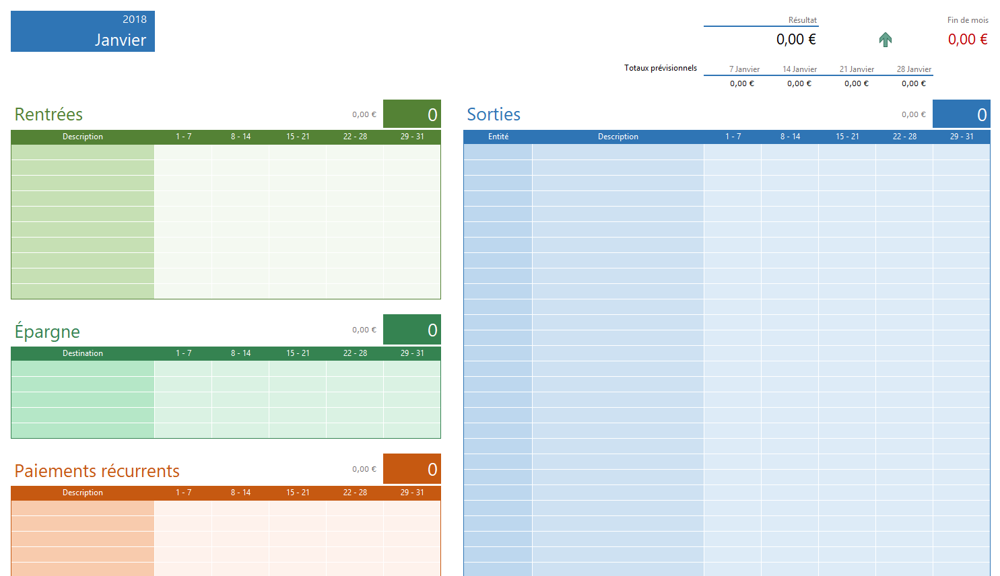

# EARG



A simple Python script that generates a full year of Excel accounting reports, starting from a single "template" Excel sheet, all thanks to the [xlwings](https://www.xlwings.org/) library.

Available under the [MIT license](https://tldrlegal.com/license/mit-license).

## Why ?

I like to manage my bank account with Excel, but got lazy to manually duplicate a sheet for each upcoming month. That's why I've automated the process so it's already done in advance for the year.

## Installation

- Clone this git repository
- `pip install -r requirements.txt`

Tested with Python 3.5.2 and Excel 2016 (version 1711) on Windows 10 x64 (version 1709).

## Usage

Call the script with the wanted year for the reports generation.

```shell
python earg.py 2018
```

Also accepts an optional argument for using another workbook as the template file.

```shell
python earg.py 2018 --template my_report.xlsx
```
